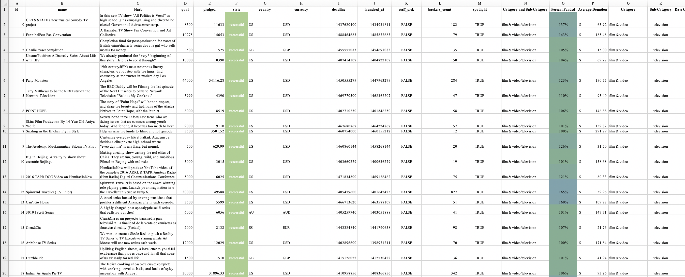
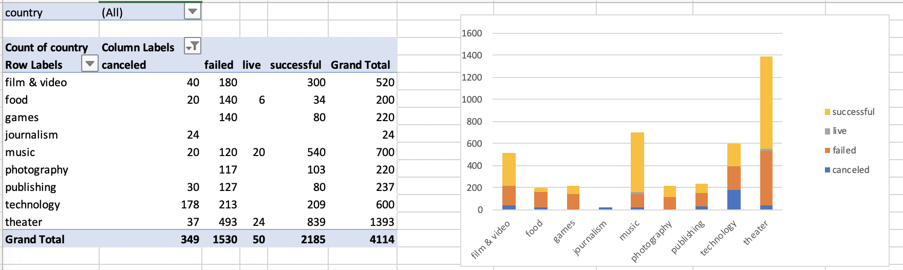
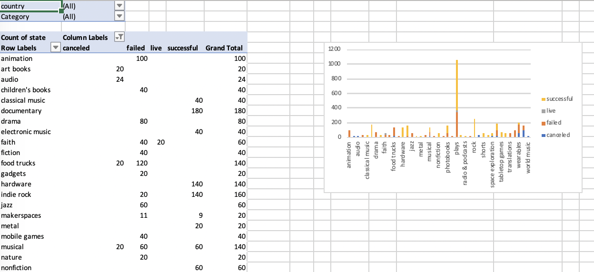
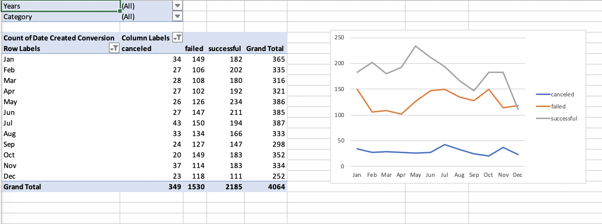

# Homework 1: Kickstart My Chart
*William (Wills) Harris*

**Given the provided data, what are three conclusions we can draw about Kickstarter campaigns?**

* Most are successful (largely independent of the time of year) and many campaigns go well over there goal. 
* Campaigns are primarily for creative projects. For instance, plays is the largest subcategory.  Technical projects are represented in far fewer numbers. 
* Average campaign donations typically range between $50 and $200.

**What are some limitations of this dataset?**

It would be nice to know the demographics of donors to help determine if the donors are local. As it is, the country information doesn’t tell us much because we can’t assume that donors are from the same country. It would also be nice to have reasons for cancellations. 

**What are some other possible tables and/or graphs that we could create?**

It would be interesting to make a histogram of the number of campaigns binned by the percentage of funding they receive. I would suspect that there are a high concentration of campaigns around 0% and a high concentration at and above 100% but few between. If so, this could in part be explained by the motivating effect of establishing a funding goal. It would also be interesting to compare the size of the goal to the success rate. Similarly, we could compare the number of donors to the success rate and tried to determine if the success of a campaign depends more on the number of donors or the donation average.

## Results 

For this homework, I preform the folowing tasks: 

* Use conditional formatting to fill each cell in the state column with a different color
  * Create a new column called Percent Funded
* Use conditional formatting to fill each cell in the Percent Funded column using a three-color scale.
  * Create a new columns called Average Donation, Category and Sub-Category

  
  
* Create a new sheet with a pivot table that will analyze your initial worksheet to count how many campaigns were successful, failed, canceled, or are currently live per category.
  * Create a stacked column pivot chart that can be filtered by country based on the table you have created.

* Create a new sheet with a pivot table that will analyze your initial sheet to count how many campaigns were successful, failed, or canceled, or are currently live per sub-category.
  * Create a stacked column pivot chart that can be filtered by country and parent-category based on the table you have created.

* Create a new sheet with a pivot table with a column of state, rows of Date Created Conversion, values based on the count of state, and filters based on parent category and Years.
  * Create a pivot chart line graph that visualizes this new table.

  
  
