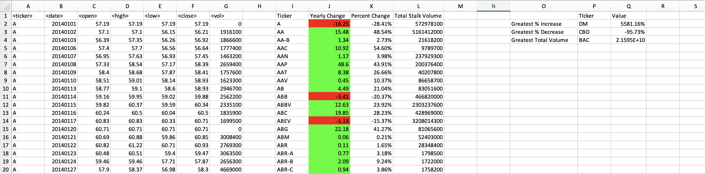
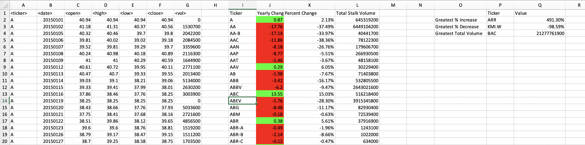
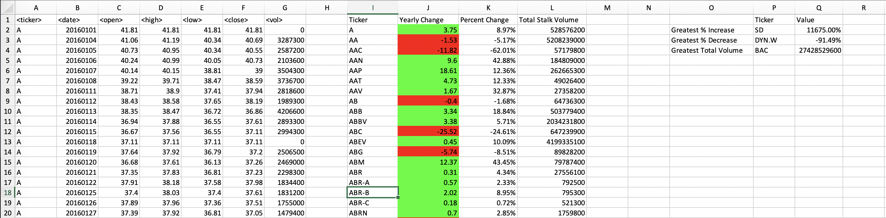

# Homework 2
I make a VBA program for stock data that...

* Records and prints the ticker symbol of each stock.

* Calculates yearly change from opening price at the beginning of a given year to the closing price at the end of that year.

* Calculates the percent change from opening price at the beginning of a given year to the closing price at the end of that year.

* Calculates the total stock volume of the stock.

* Applies conditional formatting to highlight positive change in green and negative change in red.

*  Returns the stock with the "Greatest % increase", "Greatest % Decrease" and "Greatest total volume".

The VBA script and snapshots of the analysis are provided 

## Results
Stocks from 2014:

Stocks from 2015:

Stocks from 2016:

