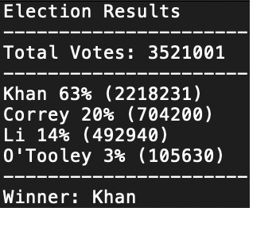

# Homework 3

* Create a Python script (PyBank) that analyzes the records to calculate each of the following:

  * The total number of months included in the dataset

  * The net total amount of "Profit/Losses" over the entire period

  * The average of the changes in "Profit/Losses" over the entire period

  * The greatest increase in profits (date and amount) over the entire period

  * The greatest decrease in losses (date and amount) over the entire period

  * Prints the analysis to the terminal and export a text file with the results.

* You will be give a set of poll data called election_data.csv. The dataset is composed of three columns: Voter ID, County, and Candidate. Your task is to create a Python script that analyzes the votes and calculates each of the following:

  * The total number of votes cast

  * A complete list of candidates who received votes

  * The percentage of votes each candidate won

  * The total number of votes each candidate won

  * The winner of the election based on popular vote.

  * Prints the analysis to the terminal and export a text file with the results.

## Results
**PyBank:**

**PyPoll:**

